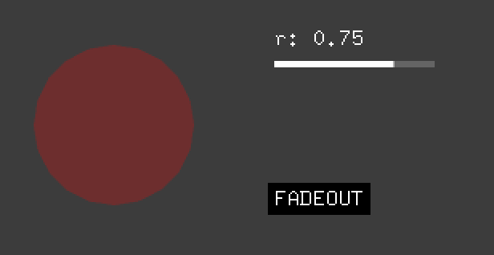

# ofxFadeHelper

Fade-in/out helper for openFrameworks

## [example_simple](./example_simple/src/ofApp.cpp)



```cpp
#include "ofxFadeHelper.h"

float t = std::fmodf(ofGetElapsedTimef(), 2.0f);

// fadein: 0.5, static: 1.0, fadeout: 0.5
ofxFadeHelper::alpha(t, 0.5f, 1.0f, 0.5f, [](float a){
    ofSetColor(255, 0, 0, a);
    ofDrawEllipse(100, 100, 100, 100);
});

// fadein: 0.5, static: 1.0, fadeout: 0.5
ofxFadeHelper::advanced(t, 0.5f, 1.0f, 0.5f, [](float r, ofxFadeHelper::Phase phase){
    std::string s1 = "r: " + ofToString(r, 2);
    ofDrawBitmapString(s1, 200, 50);

    std::string s2 = ofxFadeHelper::phaseToString(phase);
    ofDrawBitmapStringHighlight(s2, 200, 150);

    // ofSetColor(100);
    // ofDrawRectangle(200, 60, 100, 4);

    // ofSetColor(255);
    // ofDrawRectangle(200, 60, 100 * r, 4);
});
```

## [example_delta](./example_delta/src/ofApp.cpp)


```cpp
#include "ofxFadeHelper.h"

float t = std::fmodf(ofGetElapsedTimef(), 2.0f);

// fadein: 0.5, static: 1.0, fadeout: 0.5, delta: 100
ofxFadeHelper::delta<float>(t, 0.5f, 1.0f, 0.5f, 100.0f, [](float delta){
    ofSetColor(255, 0, 0);
    ofDrawEllipse(100, 100 + delta, 100, 100);
});

// fadein: 0.5, static: 1.0, fadeout: 0.5, delta: 100
ofxFadeHelper::delta<float>(t, 0.5f, 1.0f, 0.5f, 100.0f, [](float delta, float alpha){
    ofSetColor(255, 0, 0, alpha);
    ofDrawEllipse(220, 100 + delta, 100, 100);
});

// fadein: 0.5, static: 1.0, fadeout: 0.5, delta: (30, 100)
ofxFadeHelper::delta<ofVec2f>(t, 0.5f, 1.0f, 0.5f, ofVec2f(30, 100), [](ofVec2f delta, float alpha){
    ofSetColor(255, 0, 0, alpha);
    ofDrawEllipse(340 + delta.x, 100 + delta.y, 100, 100);
});
```

## Notes

- `fadeout_sec` can be `-1.0f` (minus value), means no fadeout.
- You can also get `rate` using `[](float alpha, float rate){}` for `alpha()`, or `[](float delta, float alpha, float rate)` for `delta()`.