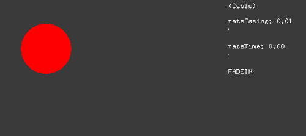
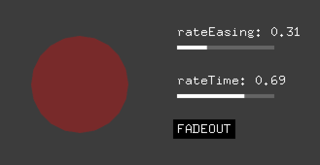
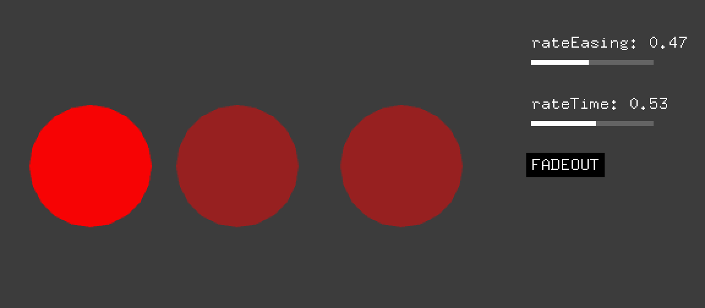
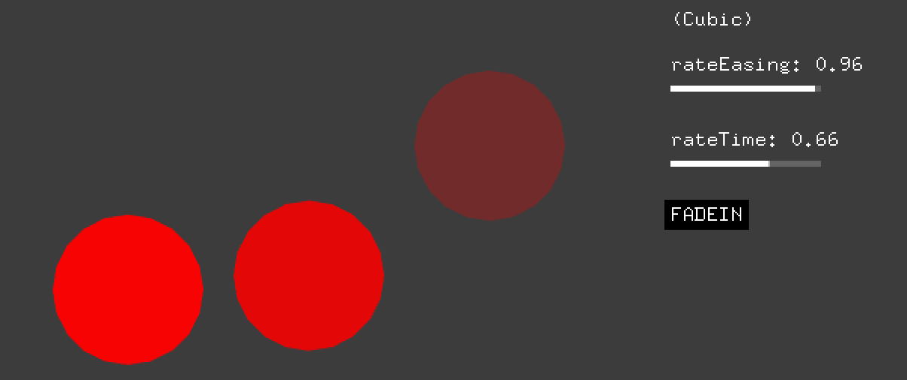
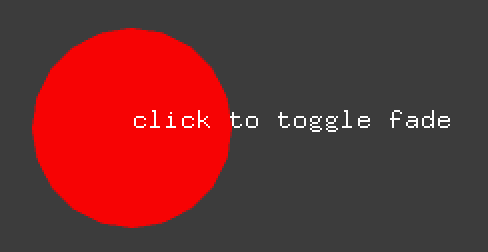

# ofxFade



Generic fade-in/out helper for openFrameworks

"Bring Your Own Engine/Framework" style. You can create more compilcated engine or framework using this helper.

This addon basically provides three functions:

- `ofxFade::alpha()`
- `ofxFade::delta<T>()`
- `ofxFade::advanced()`

And two timer classes (which has the same method above in it):

- `ofxFade::InteractiveFadeTimer`
- `ofxFade::NonInteractiveFadeTimer`

( You can also create new timer classes by extending `ofxFade::FadeTimer` or two above. )

## Table of Contents

- [Dependencies](#dependencies)
- [Examples](#examples)
  - [example\_simple](#example_simple)
  - [example\_delta](#example_delta)
  - [example\_easing](#example_easing)
  - [example\_interactive](#example_interactive)
  - [example\_non\_interactive](#example_non_interactive)
- [Notes](#notes)
  - [No fadeout](#no-fadeout)
  - [No fadein](#no-fadein)
  - [How to get `rateEasing`/`rateTime`/`phase` in `alpha()`, `delta()`](#how-to-get-rateeasingratetimephase-in-alpha-delta)
- [TODOs](#todos)
- [License](#license)


## Dependencies

- [ofxEasing](https://github.com/funatsufumiya/ofxEasing/)

## Examples

### [example_simple](./example_simple/src/ofApp.cpp)



```cpp
#include "ofxFade.h"

// loop time: 2.5 (sec)
float t = std::fmodf(ofGetElapsedTimef(), 2.5f);

// fadein: 0.5, static: 1.0, fadeout: 0.5
ofxFade::alpha(t, 0.5f, 1.0f, 0.5f, [](float a){
    ofSetColor(255, 0, 0, a);
    ofDrawEllipse(100, 100, 100, 100);
});
```

Text and indicators (Advanced usage)

```cpp
// fadein: 0.5, static: 1.0, fadeout: 0.5
ofxFade::advanced(t, 0.5f, 1.0f, 0.5f, [](float rateEasing, float rateTime, ofxFade::Phase phase){
    std::string s1 = "rateEasing: " + ofToString(rateEasing, 2);
    ofDrawBitmapString(s1, 200, 50);

    std::string s2 = "rateTime: " + ofToString(rateTime, 2);
    ofDrawBitmapString(s2, 200, 100);

    std::string s3 = ofxFade::phaseToString(phase);
    ofDrawBitmapStringHighlight(s3, 200, 150);
});
```

### [example_delta](./example_delta/src/ofApp.cpp)



```cpp
#include "ofxFade.h"

// loop time: 2.5 (sec)
float t = std::fmodf(ofGetElapsedTimef(), 2.5f);

// fadein: 0.5, static: 1.0, fadeout: 0.5, delta: 100
ofxFade::delta<float>(t, 0.5f, 1.0f, 0.5f, 100.0f, [](float delta){
    ofSetColor(255, 0, 0);
    ofDrawEllipse(100, 100 + delta, 100, 100);
});
```

and more:

```cpp
// fadein: 0.5, static: 1.0, fadeout: 0.5, delta: 100
ofxFade::delta<float>(t, 0.5f, 1.0f, 0.5f, 100.0f, [](float delta, float alpha){
    ofSetColor(255, 0, 0, alpha);
    ofDrawEllipse(220, 100 + delta, 100, 100);
});

// fadein: 0.5, static: 1.0, fadeout: 0.5, delta: (30, 100)
ofxFade::delta<ofVec2f>(t, 0.5f, 1.0f, 0.5f, ofVec2f(30, 100), [](ofVec2f delta, float alpha){
    ofSetColor(255, 0, 0, alpha);
    ofDrawEllipse(340 + delta.x, 100 + delta.y, 100, 100);
});
```

### [example_easing](./example_easing/src/ofApp.cpp)



```cpp
#include "ofxFade.h"

// loop time: 2.5 (sec)
float t = std::fmodf(ofGetElapsedTimef(), 2.5f);

// fadein: 0.5, static: 1.0, fadeout: 0.5, delta: 100, cubic (out)
ofxFade::delta<float>(t, 0.5f, 1.0f, 0.5f, 100.0f, [](float delta){
    ofSetColor(255, 0, 0);
    ofDrawEllipse(100, 100 + delta, 100, 100);
}, ofxeasing::Function::Cubic);

// fadein: 0.5, static: 1.0, fadeout: 0.5, delta: 100, bounce in, linear out
ofxFade::delta<float>(t, 0.5f, 1.0f, 0.5f, 100.0f, [](float delta, float alpha){
    ofSetColor(255, 0, 0, alpha);
    ofDrawEllipse(220, 100 + delta, 100, 100);
}, ofxeasing::Function::Bounce, ofxeasing::Type::Out,
    ofxeasing::Function::Linear, ofxeasing::Type::In);

// fadein: 0.5, static: 1.0, fadeout: 0.5, cubic (in)
ofxFade::alpha(t, 0.5f, 1.0f, 0.5f, [](float alpha){
    ofSetColor(255, 0, 0, alpha);
    ofDrawEllipse(340, 100, 100, 100);
}, ofxeasing::Function::Cubic, ofxeasing::Type::In);

// fadein: 0.5, static: 1.0, fadeout: 0.5, cubic (out)
ofxFade::advanced(t, 0.5f, 1.0f, 0.5f, [](float r, float rt, ofxFade::Phase phase){
    const float x = 460;

    std::string s1 = "rateEasing: " + ofToString(r, 2);
    ofDrawBitmapString(s1, x, 50);

    std::string s2 = "rateTime: " + ofToString(rt, 2);
    ofDrawBitmapString(s2, x, 100);

    std::string s3 = ofxFade::phaseToString(phase);
    ofDrawBitmapStringHighlight(s3, x, 150);

}, ofxeasing::Function::Cubic);
```

### [example_interactive](./example_interactive/src/ofApp.cpp)



```cpp
#include "ofxFade.h"

ofxFade::InteractiveFadeTimer timer;

//--------------------------------------------------------------
void ofApp::setup(){
    // fadein = 1.0, fadeout = 1.0 (sec)
    timer = ofxFade::InteractiveFadeTimer(1.0f, 1.0f);
    timer.start();
}

//--------------------------------------------------------------
void ofApp::update(){

}

//--------------------------------------------------------------
void ofApp::draw(){
    timer.alpha([](float a){
        ofSetColor(255, 0, 0, a);
        ofDrawEllipse(100, 100, 100, 100);
    });

    ofDrawBitmapString("click to toggle fade", 100, 100);
}

//--------------------------------------------------------------
void ofApp::mousePressed(int x, int y, int button){
    if(timer.isStarted() && !timer.isFadeOutStarted()){
        timer.fadeOut();
    }else if(timer.isFinished()){
        timer.start();
    }
}
```

### [example_non_interactive](./example_non_interactive/src/ofApp.cpp)


```cpp
#include "ofxFade.h"

ofxFade::NonInteractiveFadeTimer timer;

//--------------------------------------------------------------
void ofApp::setup(){
    // fadein = 1.0, static = 1.0, fadeout = 0.5 (sec)
    timer = ofxFade::NonInteractiveFadeTimer(1.0f, 1.0f, 0.5f);
    timer.start();
}

//--------------------------------------------------------------
void ofApp::update(){

}

//--------------------------------------------------------------
void ofApp::draw(){
    timer.delta<float>(100, [](float delta, float alpha){
        ofSetColor(255, 0, 0, alpha);
        ofDrawEllipse(220, 100 + delta, 100, 100);
    }, ofxeasing::Function::Bounce, ofxeasing::Type::Out,
        ofxeasing::Function::Linear, ofxeasing::Type::In);

    // if(timer.isFinished()){
        ofDrawBitmapString("click to restart", 400, 100);
    // }
}

//--------------------------------------------------------------
void ofApp::mousePressed(int x, int y, int button){
    // if(timer.isFinished()){
        timer.start();
    // }
}
```

## Notes

### No fadeout

`fadeout_sec` can be `-1.0f` (minus value), means no fadeout.

### No fadein

Just set `0` to `fadein_sec`

### How to get `rateEasing`/`rateTime`/`phase` in `alpha()`, `delta()`

- Additional args of function (callback):
  - To get `rateEasing`, use:
    - `[](float alpha, float rateEasing){}` for `alpha()`
    - `[](float delta, float alpha, float rateEasing)` for `delta()`
  - To get `rateTime, phase`, use:
    - `[](float alpha, float rateEasing, float rateTime, Phase phase){}` for `alpha()`
    - `[](float delta, float alpha, float rateEasing, float rateTime, Phase phase)` for `delta()`

### Custom `delta` class

You can pass any custom class `T` for `delta<T>()`, if it can be multiplied (`*`) by `rate` (please implement `operator *(float)`.)

## TODOs

- add advanced example

## License

Dual licensed under WTFPL and/or 0BSD.
